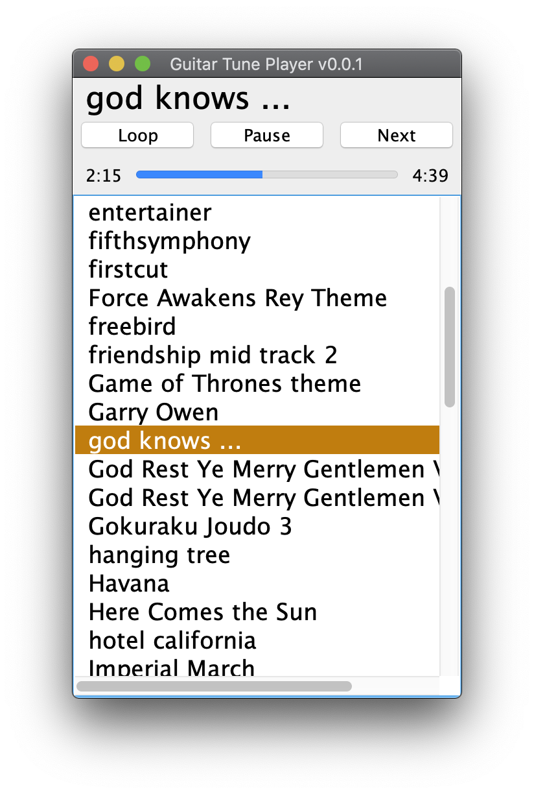

# Guitar Tune Player

A music player that utilizes Guitar37 from Guitar Hero, the second assignment to 
[University of Washington CSE 143](https://www.cs.washington.edu/143).

## How to Use?

Download [GuitarTunePlayer.java](https://raw.githubusercontent.com/ApolloZhu/GuitarTunePlayer/master/src/GuitarTunePlayer.java)
and put it in the same folder as your Guitar37.java 
(and of course, the same folder where your other
 [start code](https://courses.cs.washington.edu/courses/cse143/19au/homework/a2/a2.zip) should be).

## Development

Put your completed `GuitarString.java` and `Guitar37.java` into `src` folder, and use your favorite
IDE to run the main method defined in `GuitarTunePlayer.java`. 

You can open this project in IntelliJ IDEA, which students 
[get for free](https://blog.jetbrains.com/blog/2018/09/18/free-jetbrains-licenses-as-part-of-github-student-developer-pack/).

## Academic Integrity

Never share your `Guitar37.java`, `GuitarString.java`, `Guitar37.class`, `GuitarString.class`
and/or other assignment solution code related files with anyone. For more information, check with
your [syllabus](https://courses.cs.washington.edu/courses/cse143/19au/handouts/syllabus.pdf).

## Acknowledgement

GuitarTunePlayer is licensed under MIT License.
Other Java source files under the `src` folder are provided by 
University of Washington CSE 143 class 
[Guitar Hero](https://courses.cs.washington.edu/courses/cse143/19au/homework/a2/spec.pdf)
assignment. Sources of other segments of this project that's 
adapted from others' work are documented at the site of declaration.
